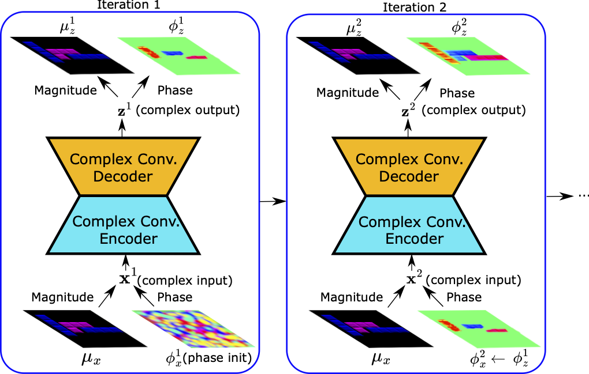
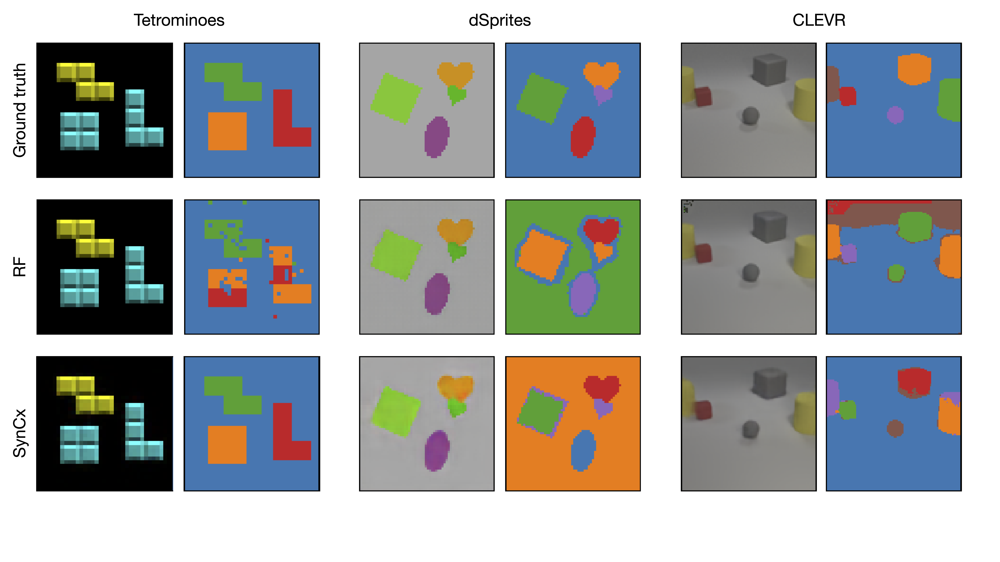

# Recurrent Complex-Weighted Autoencoders for Unsupervised Object Discovery

Current state-of-the-art synchrony-based models encode object bindings with
complex-valued activations and compute with real-valued weights in feedforward
architectures. We argue for the computational advantages of a recurrent architec-
ture with complex-valued weights. We propose a fully convolutional autoencoder,
SynCx, that performs iterative constraint satisfaction: at each iteration, a hidden
layer bottleneck encodes statistically regular configurations of features in particular
phase relationships; over iterations, local constraints propagate and the model
converges to a globally consistent configuration of phase assignments. Binding is
achieved simply by the matrix-vector product operation between complex-valued
weights and activations, without the need for additional mechanisms that have
been incorporated into current synchrony-based models. SynCx outperforms or
is strongly competitive with current models for unsupervised object discovery.
SynCx also avoids certain systematic grouping errors of current models, such as
the inability to separate similarly colored objects without additional supervision. 

This repo provides a reference implementation for the Synchronous Complex Network (SynCx) model architecture introduced in the paper titled "Recurrent Complex-Weighted Autoencoders for Unsupervised Object Discovery" ([https://arxiv.org/abs/2405.17283](https://arxiv.org/abs/2405.17283)).

-------------------------------



-------------------------------



-------------------------------


## Setup

To download the data use the links provided on the EMORL GitHub repository: [https://github.com/pemami4911/EfficientMORL](https://github.com/pemami4911/EfficientMORL), or directly from here: [https://zenodo.org/records/4895643](https://zenodo.org/records/4895643). Save the `*.h5` files under `data` folder in this git repository.


## Run Experiments

To train and test the SynCx, run one of the following commands, depending on the dataset:

```python train.py --profile=syncx_tetrominoes```

```python train.py --profile=syncx_dsprites```

```python train.py --profile=syncx_clevr```

To train and test the Rotating Features (RF) baseline model, run one of the following commands, depending on the dataset:

```python train.py --profile=rf_tetrominoes```

```python train.py --profile=rf_dsprites```

```python train.py --profile=rf_clevr```

Remember to edit the `entity` and `project` arguments for `wandb.init` command in `train.py` to log the experiments on your Weights&Biases account and desired project folder. 


## Citation
When using this code, please cite our paper:

```
@inproceedings{gopalakrishnan2024recurrent,
  title={Recurrent Complex-Weighted Autoencoders for Unsupervised Object Discovery},
  author={Gopalakrishnan, Anand and Stani{\'c}, Aleksandar and Schmidhuber, J{\"u}rgen and Mozer, Michael Curtis},
  booktitle={Thirty-eighth Conference on Neural Information Processing Systems},
  year={2024}
}
```

## Contact
For questions and suggestions, feel free to open an issue on GitHub or send an email to [anand@idsia.ch](mailto:anand@idsia.ch).